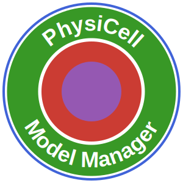

<p align="center"></p>

# PhysiCellModelManager.jl

[](https://drbergman-lab.github.io/PhysiCellModelManager.jl/stable/)
[](https://drbergman-lab.github.io/PhysiCellModelManager.jl/dev/)
[](https://github.com/drbergman-lab/PhysiCellModelManager.jl/actions/workflows/CI.yml?query=branch%3Amain)
[](https://codecov.io/gh/drbergman-lab/PhysiCellModelManager.jl)

Check out [Getting started](https://drbergman-lab.github.io/PhysiCellModelManager.jl/stable/man/getting_started/) for a quick guide to using PhysiCellModelManager.jl.
Make sure you are familiar with the [Best practices](https://drbergman-lab.github.io/PhysiCellModelManager.jl/stable/man/best_practices/) section before using PhysiCellModelManager.jl.

# Quick start

See [Getting started](https://drbergman-lab.github.io/PhysiCellModelManager.jl/stable/man/getting_started/) for more details.

1. [Install Julia](https://julialang.org/install).
2. Ensure the general registry is added:
```julia-repl
pkg> registry add General
```
3. Add the BergmanLabRegistry:
```julia-repl
pkg> registry add https://github.com/drbergman-lab/BergmanLabRegistry
```
4. Install PhysiCellModelManager.jl:
```julia-repl
pkg> add PhysiCellModelManager
```
5. Create a new PCMM project:
```julia-repl
julia> using PhysiCellModelManager
julia> createProject() # uses the current directory as the PCMM project folder
```
> Note: A PCMM project is distinct from PhysiCell's `sample_projects` and `user_projects`.
6. Import a sample project or a user project from PhysiCell:
```julia-repl
julia> importProject("path/to/PhysiCell/user_projects/my_project") # replace with the path to your project folder
```
7. Check the output of Step 6 and record your input folders:
```julia-repl
julia> config_folder = "my_project" # replace these with the name from the output of Step 6
julia> custom_code_folder = "my_project"
julia> rules_folder = "my_project" 
julia> inputs = InputFolders(config_folder, custom_code_folder; rulesets_collection = rules_folder) # also add ic_cell and ic_substrate if used
```
8. Run the model:
```julia-repl
julia> out = run(inputs; n_replicates = 1)
```
9. Check the output:
```julia-repl
julia> using Plots # make sure to install Plots first
julia> plot(out)
julia> plotbycelltype(out)
```
10. Vary parameters:
```julia-repl
julia> xml_path = configPath("some_cell_type", "apoptosis", "death_rate") # replace with a cell type in your model
julia> new_apoptosis_rates = [1e-5, 1e-4, 1e-3]
julia> dv = DiscreteVariation(xml_path, new_apoptosis_rates)
julia> out = run(inputs, dv; n_replicates = 3) # 3 replicates per apoptosis rate => 9 simulations total
```

---

## Implementation Status

> For Claude Code sessions: this section is the authoritative record of what has been built. Update it as features are completed. See [PRD.md](PRD.md) for behavioral specifications and [progress.md](progress.md) for decision rationale.

### Completed

- [x] Project initialization (`createProject`, `initializeModelManager`)
- [x] Model import from PhysiCell project folders (`importProject`, `InputFolders`)
  - [ ] Wizard for guiding users through the import process and recording their input folders
- [x] Parameter variation — discrete, grid, distributed, latent, co-variation
- [x] Space-filling designs — LHS, Sobol, RBD
- [x] Simulation execution — local multi-process runner
- [x] HPC job script generation and submission
- [x] Analysis — population counts and time series (`finalPopulationCount`, `populationTimeSeries`, `meanPopulationTimeSeries`)
- [x] Sensitivity analysis — MOAT, Sobol, and RBD
- [x] Calibration — PhysiCell-specific summary statistics (`endpointPopulationCounts`, `endpointPopulationFractions`, `meanPopulationTimeSeries`) for use with ModelManager's `CalibrationProblem`; ABC-SMC algorithm, posterior visualization, and `resumeABC` live in ModelManager
  - [ ] GP-accelerated ABC (surrogate model to reduce expensive PhysiCell evaluations)
  - [ ] Bayesian optimization
  - [ ] Additional methods (MCMC, Nelder-Mead, etc.) as subtypes of `AbstractCalibrationMethod`
- [x] Database management — SQLite schema, versioned migrations (`up.jl`), diagnostics
  - [x] Upgrade-path CI — dedicated workflow replays version history (generate with an older release, upgrade with the dev checkout) to guard `up.jl`; see [`test/upgrade/`](test/upgrade/). Source matrix currently `0.1.7` (real users' oldest version; crosses the `0.2.0` par_key rewrite) and `0.2.2`; walks back over time toward `pcvct@0.0.3`.
- [x] Export and pruning of simulation outputs
- [x] Post-processing hook (`post_processor`) — user callback runs on intact simulation output before PCMM's destructive cleanup (`postSimulationCleanup`); results stored via ModelManager's QoI sink (`postProcessingTable`, `simulationsTable(...; post_processing=true)`)
  - [ ] Ready-made PhysiCell QoI builders (e.g. `populationCountQoI`) so a `post_processor` can be a one-liner
- [x] Intracellular model support (custom data, rules)
- [x] IC cell and IC ECM file management

### Remaining

- [ ] Support showing snapshots from a monad/sampling/trial in a single figure. Support CairoMakie (as extension) to make a movie from the snapshots.
- [ ] GP-accelerated ABC and additional calibration methods (see Calibration bullet above)
