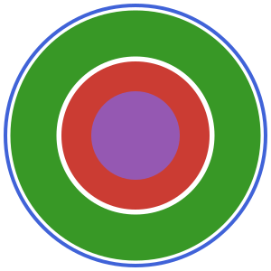

```@meta
CurrentModule = PhysiCellModelManager
```

```@raw html
<p align="center"></p>
```

# PhysiCellModelManager.jl

[PhysiCellModelManager.jl](https://github.com/drbergman-lab/PhysiCellModelManager.jl) (PCMM) is a Julia package for running large [PhysiCell](https://github.com/MathCancer/PhysiCell) simulation campaigns. It manages the inputs, variations, and databases so you can define a parameter sweep, sensitivity analysis, or calibration once and let PCMM organize, deduplicate, and reproduce the runs.

New here? Start with [Installation](@ref installation_man), then [Your first project](@ref getting_started_man).

## Where do I look?

### Getting set up

| I want to… | Go to |
| --- | --- |
| Install the package and run my first simulations | [Installation](@ref installation_man), [Your first project](@ref getting_started_man) |
| Set up a reproducible Julia environment | [Julia environments](@ref julia_environments_man) |
| Bring in an existing PhysiCell project | [Importing a project](@ref importing_projects_man) |

### Building and varying a model

| I want to… | Go to |
| --- | --- |
| Change parameter values across runs | [Varying parameters](@ref varying_parameters_man), [XML path helpers](@ref xml_path_helpers_man) |
| Vary parameters together or under constraints | [CoVariations](@ref covariations_man), [LatentVariations](@ref latent_variations_man) |
| Add an intracellular (ODE) model | [Intracellular inputs](@ref intracellular_inputs_man) |

### Getting results out

| I want to… | Go to |
| --- | --- |
| Plot or query results | [Analyzing output](@ref analyzing_output_man), [Querying parameters](@ref querying_parameters_man) |
| Compute quantities while runs are still in flight | [Post-processing and quantities of interest](@ref post_processing_man) |
| Measure spatial structure or cell–cell contacts | [Pair correlation function](@ref pcf_section), [Graph analysis](@ref graph_analysis_section) |
| Turn snapshots into a movie | [Movies](@ref movies_man) |
| Label a batch of runs and find them again later | [Tagging and recovery](@ref tagging_man) |

### Analyzing and fitting

| I want to… | Go to |
| --- | --- |
| Find out which parameters matter most | [Sensitivity analysis](@ref sensitivity_analysis_man) |
| Fit a model to data with ABC-SMC | [Calibration](@ref calibration_section_man) |

### Reference and troubleshooting

| I want to… | Go to |
| --- | --- |
| Copy-paste a recipe | [Examples](@ref examples_cookbook) |
| Look up a function's signature | the [Index](@ref index_man) (all exported symbols) |
| Understand where PCMM puts things on disk | [Data directory structure](@ref data_directory_man), [Project configuration](@ref project_configuration_man) |
| Open a project in the PhysiCell GUI | [Using PhysiCell Studio](@ref physicell_studio_man) |
| Upgrade an older project's database | [Database upgrades](@ref database_upgrades_misc) |
| Troubleshoot something | [Known limitations](@ref known_limitations_man), [Best practices](@ref best_practices_man) |

## Issues

Have a problem? First check [Known limitations](@ref known_limitations_man) and [Best practices](@ref best_practices_man). If it persists, please open an issue [here](https://github.com/drbergman-lab/PhysiCellModelManager.jl/issues).
