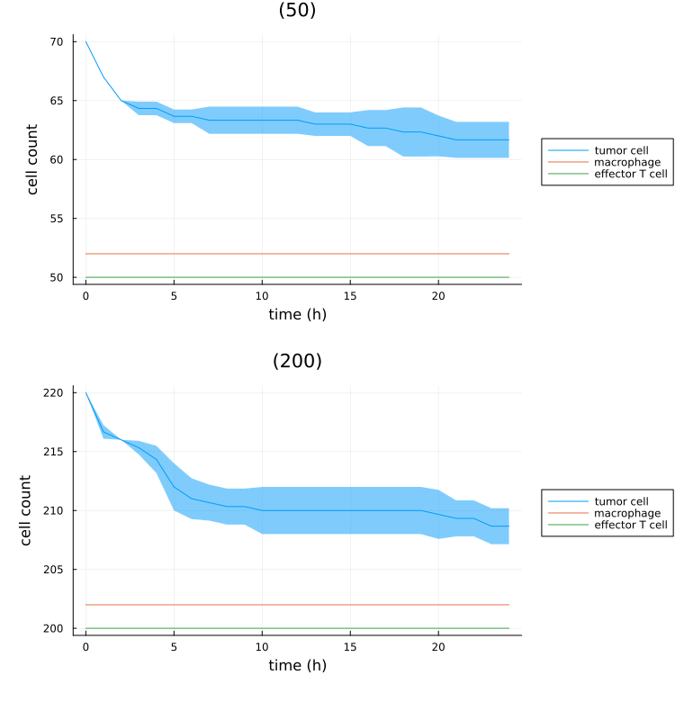
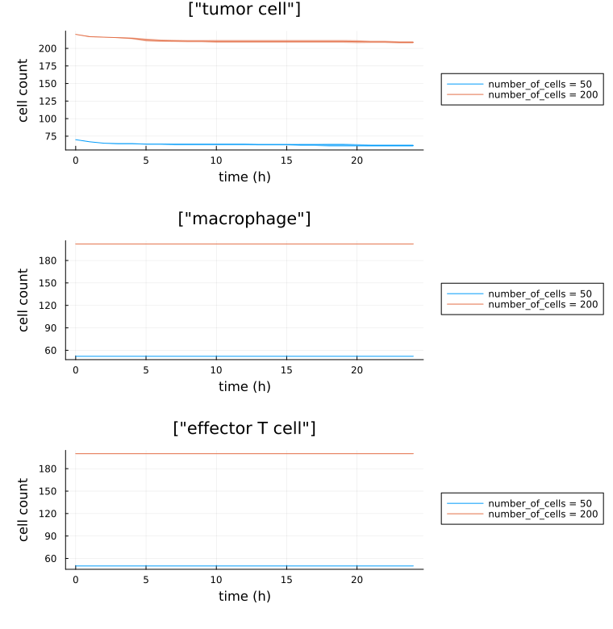
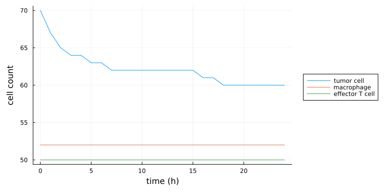

# [Analyzing output](@id analyzing_output_man)

Read a finished simulation's cells, substrates, graphs and population counts back into Julia, and
plot them.

## Install dependencies

!!! tiergloss
    The examples use `Plots.jl`.

```julia-repl
pkg> add Plots
```

## Loading output

### [`PhysiCellSnapshot`](@id physi_cell_snapshot_section)

!!! tiergloss
    The base unit of PhysiCell output is the [`PhysiCellSnapshot`](@ref). Each records the
    output-folder path, its index in the output sequence, the simulation time, and optionally the
    cell, substrate, and mesh data at that snapshot. Index it by integer, or by `:initial` /
    `:final`.

```julia
snapshot = PhysiCellSnapshot(1, :final; include_cells=true) #! last save of simulation 1
snapshot = PhysiCellSnapshot(Simulation(1), 3)              #! the 4th save, no data loaded yet
```

!!! tierdev
    Passing a simulation ID or a `Simulation` is PhysiCellModelManager.jl's database-identity entry
    point: it asserts the project is initialized, resolves the ID to an output folder, and delegates
    to the folder-based constructor in PhysiCellOutput.jl. It returns `missing` (with a printed
    message) when the files are not there, e.g. for a pruned simulation.

### [`PhysiCellSequence`](@id physi_cell_sequence_section)

!!! tiergloss
    A [`PhysiCellSequence`](@ref) is the full sequence of snapshots for a single simulation, plus
    the output-folder path and simulation metadata.

```julia
sequence = PhysiCellSequence(1; include_cells=true) #! every snapshot of simulation 1
```

### Loading data into a snapshot or sequence

!!! tiergloss
    A snapshot or sequence built without the `include_*` keywords carries no data. Four functions
    fill one in place, reading the cell-type names, labels and substrate names from the XML
    themselves, so you never have to compute those and pass them in.

```julia
snapshot = PhysiCellSnapshot(1, :final)
loadCells!(snapshot)                 #! the cell DataFrame
loadSubstrates!(snapshot)            #! substrate concentrations
loadMesh!(snapshot)                  #! the mesh
loadGraph!(snapshot, :neighbors)     #! one of :neighbors, :attachments, :spring_attachments

sequence = PhysiCellSequence(1)
loadCells!(sequence)                 #! the same four work on a whole sequence
```

### [`cellDataSequence`](@id cell_data_sequence_section)

!!! tiergloss
    [`cellDataSequence`](@ref) follows individual cells through time. It accepts a simulation ID
    (`<:Integer`), a `::Simulation`, or a `::PhysiCellSequence`, together with one label
    (`::String`) or several (`::Vector{String}`), and returns a dictionary keyed by integer cell ID
    whose values are named tuples with the requested labels plus `:time`.

```julia
data = cellDataSequence(1, "position")

#! an Nx3 matrix for the N integer-indexed outputs (ignores the `initial_*` and `final_*` files)
cell_78_positions = data[78].position
cell_78_times = data[78].time

using Plots
plot(cell_78_times, cell_78_positions[:,1]) #! the x-coordinate of cell 78 over time
```

!!! tierwhy
    Each call to [`cellDataSequence`](@ref) loads *all* the data unless a `PhysiCellSequence` is
    passed in. Loading simulation data is not fast, so build the sequence once and reuse it if you
    are going to ask several questions of the same simulation.

## Population counts and time series

!!! tiergloss
    [`populationCount`](@ref) counts the cells in one snapshot and returns a `Dict` from cell type
    name to count; dead cells are excluded unless `include_dead=true`.
    [`finalPopulationCount`](@ref) is the shorthand for a whole simulation's last snapshot — on a
    `Monad` it returns the mean count across replicates. [`populationTimeSeries`](@ref) returns the
    whole curve rather than one point.

```julia
populationCount(PhysiCellSnapshot(1, :final))        #! Dict("cancer" => 1234, "cd8" => 56, ...)
finalPopulationCount(1)["cancer"]                    #! same count, without naming the snapshot

spts = populationTimeSeries(Simulation(1))           #! a SimulationPopulationTimeSeries
spts.time                                            #! the save times
spts["cancer"]                                       #! "cancer" counts, one per save time

mpts = populationTimeSeries(Monad(1))                #! a MonadPopulationTimeSeries
mpts["cancer"].mean                                  #! across replicates; also .std and .counts
```

!!! tiergloss
    [`populationTimeSeries`](@ref) returns a
    [`SimulationPopulationTimeSeries`](@ref PhysiCellModelManager.SimulationPopulationTimeSeries)
    for a `Simulation` and a
    [`MonadPopulationTimeSeries`](@ref PhysiCellModelManager.MonadPopulationTimeSeries) for a
    `Monad`; both also accept the result of `run`. Both index by cell type name, and by `"time"`.
    A simulation's series stores a plain `Vector` of counts per cell type; a monad's stores a named
    tuple of `counts`, `mean` and `std` over its replicates.

!!! tierwhy
    A `SimulationPopulationTimeSeries` built from a `Simulation` or a simulation ID writes itself to
    `simulations/<id>/summary/` and is read back from there on the next call, so re-running an
    analysis does not re-walk every snapshot. `include_dead=true` is cached to its own file rather
    than overwriting the live-only one. A snapshot whose files are gone yields `missing` from
    [`populationCount`](@ref) and is skipped in the series, so pruned output degrades the curve
    rather than killing the call.

## Simulation runtime

!!! tiergloss
    `simulationRuntime` returns how long PhysiCell took to reach a snapshot, as a
    `Dates.Nanosecond`. Given a `Simulation`, a simulation ID, or a `run` result it reports the
    final snapshot — i.e. the whole simulation.

```julia
using Dates, Statistics
runtime = simulationRuntime(1)                     #! a Nanosecond
println(canonicalize(runtime))                     #! e.g. 2 minutes, 53 seconds, 748 milliseconds

runtimes = simulationRuntime.(1:4)
Nanosecond(round(mean([r.value for r in runtimes]))) #! mean runtime over four simulations
```

## Population plots

### Group by Monad

!!! tiergloss
    Call `plot` on a `Simulation`, `Monad`, `Sampling`, or a `run` result (but not a sensitivity
    analysis) to get a figure of panels. Each panel is one `Monad` — replicates with the same
    parameters — and plots mean ± SD per cell type.

```julia
using Plots
plot(sampling)                                       #! one panel per monad
plot(sampling; include_dead=true)                    #! count dead cells too
plot(sampling; include_cell_type_names="cancer")     #! restrict to one cell type
plot(sampling; exclude_cell_type_names="cancer")     #! or drop one
plot(sampling; time_unit=:h)                         #! x-axis in hours
```

One panel per `Monad`, with each cell type a series and the shaded band its standard deviation
across replicates:



!!! tiergloss
    `include_cell_type_names` and `exclude_cell_type_names` also accept a `Vector{String}`. If an
    entry of `include_cell_type_names` is itself a `Vector{String}`, those cell types are summed
    into one series — the way to add a total alongside its components.

```julia
using Plots
#! total tumor count alongside its epithelial ("epi") and mesenchymal ("mes") components
plot(Monad(1); include_cell_type_names=["epi", "mes", ["epi", "mes"]])
```

!!! tiergloss
    These are Julia plot recipes (see [RecipesBase.jl](https://docs.juliaplots.org/stable/RecipesBase/)),
    so any standard plotting keyword can be passed through.

```julia
using Plots
colors = [:blue :red] #! note the absence of a `,` or `;`: this is how Julia passes per-series values
plot(Simulation(1); color=colors, include_cell_type_names=["cd8", "cancer"]) #! cd8 blue, cancer red
```

### Group by cell type

!!! tiergloss
    [`plotbycelltype`](@ref) inverts the grouping: one panel per cell type, with every monad as a
    series inside it. It works on a `Simulation`, `Monad` or `Sampling`, and on the `MMOutput` that `run`
    returns; a `Trial` is refused, because its samplings need not share a cell-type roster. It
    takes everything listed above for `plot`. `plotbycelltype!` is its mutating form, drawing into an existing plot
    instead of creating one.

```julia
using Plots
plotbycelltype(Sampling(1); include_cell_type_names=["epi", "mes", ["epi", "mes"]], color=[:blue :red :purple], labels=["epi" "mes" "both"], legend=true)
```

The same simulations as the figure above, regrouped — one panel per cell type, each series a
`Monad`:



!!! tierwhy
    Note the inversion when reading a legend: in `plot` a series is a cell type, in
    [`plotbycelltype`](@ref) a series is a monad.

A single `Simulation` has no replicates to summarize, so it plots one line per cell type with no
band:



!!! tierdev
    **Regenerating these figures.** They are committed under `docs/src/assets/` rather than rendered
    during the docs build, which has no compiled PhysiCell. Run
    `julia --project=docs docs/generate_figures.jl <path/to/project>` to remake them after changing
    a plot recipe.

## Substrate analysis

PhysiCellModelManager.jl supports two ways to summarize substrate information over time.

### [`AverageSubstrateTimeSeries`](@id average_substrate_time_series_section)

!!! tiergloss
    An `AverageSubstrateTimeSeries` gives the time series for the average substrate across the
    entire domain. Index it by substrate name.

```julia
simulation_id = 1
asts = PhysiCellModelManager.AverageSubstrateTimeSeries(simulation_id)
using Plots
plot(asts.time, asts["oxygen"])
```

### [`ExtracellularSubstrateTimeSeries`](@id extracellular_substrate_time_series_section)

!!! tiergloss
    An `ExtracellularSubstrateTimeSeries` gives the time series for the average substrate
    concentration in the extracellular space neighboring all cells of a given cell type. Index it by
    cell type, then by substrate — below, the average IFNg concentration experienced by CD8+ T cells.

```julia
simulation_id = 1
ests = PhysiCellModelManager.ExtracellularSubstrateTimeSeries(simulation_id)
using Plots
plot(ests.time, ests["cd8"]["IFNg"])
```

## Motility analysis

!!! tiergloss
    [`motilityStatistics`](@ref) returns the time alive, distance traveled, and mean speed for each
    cell in the simulation, split among the cell types that cell assumed over the run (or at least
    at the save times). Pass `direction` to consider only one coordinate axis.

!!! tierwhy
    The cell type at the *start* of each save interval is the one credited with that interval, and
    speed comes from net displacement over the interval rather than path length — so a cell that
    doubles back inside one save interval reads as slower than it was.

```julia
simulation_id = 1
mss = motilityStatistics(simulation_id)
all_mean_speeds_as_mes = [ms["mes"].speed for ms in mss if haskey(ms, "mes")] #! speeds while "mes"
all_times_as_mes = [ms["mes"].time for ms in mss if haskey(ms, "mes")]        #! time spent as "mes"
mean_mes_speed = all_mean_speeds_as_mes .* all_times_as_mes |> sum            #! weighted average...
mean_mes_speed /= sum(all_times_as_mes)                                       #! ...finished
```

```julia
mss = motilityStatistics(simulation_id; direction=:x) #! only movement in the x direction
```

## [Pair correlation function](@id pcf_section)

!!! tierwhy
    Sometimes referred to as radial distribution functions, the pair correlation function (PCF)
    computes the density of target cells around center cells. If the two sets of cells are the same
    (centers = targets), this is called PCF; if they differ, this is sometimes called cross-PCF.
    Both come from the same call.

!!! tiergloss
    `pcf` accepts a `PhysiCellSnapshot`, a `PhysiCellSequence`, or a `Simulation`. An `Integer`
    first argument is treated as a simulation ID; follow it with an index (an `Integer`, or
    `:initial` / `:final`) to compute at one snapshot rather than over the whole simulation. Next
    comes the center cell type (a `String` or `Vector{String}`), then optionally the target cell
    type; omit the target and the centers are used, giving a non-cross PCF. The center and target
    sets must be identical or disjoint. Call it as `PhysiCellModelManager.pcf`, or as plain `pcf`
    once `using PairCorrelationFunction` has been called.

### Keyword arguments

!!! tiergloss
    - `include_dead::Union{Bool, Tuple{Bool,Bool}} = false`: whether to include dead cells.
      `true` includes all cells, `false` only live ones, and a tuple sets centers and targets
      separately.
    - `dr::Float64 = 20.0`: the step size for the radial bins, in micrometers.

### Output

!!! tiergloss
    `pcf` returns a `PCMMPCFResult` with two fields. `time` is always a vector of the time points at
    which the PCF was computed, even for a single snapshot. `pcf_result` is a
    `PairCorrelationFunction.PCFResult` with fields `radii` (the bin cutoffs) and `g` (a vector or a
    `length(radii)-1` by `length(time)` matrix of PCF values).

### Plotting

!!! tiergloss
    Pass a `PCMMPCFResult` straight to `plot` to reach PairCorrelationFunction.jl's plotting
    interface. Pass several, or a `Vector{PCMMPCFResult}`, and they are treated as stochastic
    realizations of the same PCF and summarized. See the
    [PairCorrelationFunction.jl documentation](https://drbergman-lab.github.io/PairCorrelationFunction.jl/stable/)
    for more details.

    PhysiCellModelManager.jl adds two keyword arguments: `time_unit::Symbol = :min` (also `:s`,
    `:h`, `:d`, `:w`, `:mo`, `:y`; only relevant when the result has more than one time point) and
    `distance_unit::Symbol = :um` (also `:mm`, `:cm`).

!!! tierwhy
    PairCorrelationFunction.jl's own `colorscheme` keyword also works. PhysiCellModelManager.jl
    overrides that package's default of `:tofino` with `:cork`, so that white represents values near
    one — the value at which the targets are neither clustered near nor excluded from the centers.

### Examples

```julia
simulation_id = 1
#! `using PairCorrelationFunction` obviates the need to prefix with `PhysiCellModelManager`
result = PhysiCellModelManager.pcf(simulation_id, "cancer", "cd8")
plot(result) #! heatmap of proximity of (living) cd8s to (living) cancer cells throughout simulation 1
```
```julia
monad = Monad(1) #! let's assume that there are >1 simulations in this monad
#! one vector of PCF values for each simulation at the final snapshot
results = [PhysiCellModelManager.pcf(simulation_id, :final, "cancer", "cd8") for simulation_id in simulationIDs(monad)]
plot(results) #! line plot of average PCF values against radius across the monad +/- 1 SD
```
```julia
monad = Monad(1) #! let's assume that there are >1 simulations in this monad
#! one matrix of PCF values for each simulation across all time points
results = [PhysiCellModelManager.pcf(simulation_id, "cancer", "cd8") for simulation_id in simulationIDs(monad)]
#! heatmap of average PCF values, time on the x-axis and radius on the y-axis; averages omit the
#! NaN values that can occur at higher radii
plot(results)
```

## [Graph analysis](@id graph_analysis_section)

!!! tiergloss
    Every PhysiCell simulation produces three directed graphs at each save time point. The vertices
    are the cell agents; the edges are `:neighbors` (the cells overlap, based on their positions and
    adhesion radii), `:attachments` (manually-defined attachments between cells), and
    `:spring_attachments` (spring attachments formed automatically using attachment rates).
    [`connectedComponents`](@ref) is what PhysiCellModelManager.jl computes on them; load a graph
    with `loadGraph!` (provided by [PhysiCellOutput.jl](https://github.com/drbergman-lab/PhysiCellOutput.jl))
    for any other analysis.

!!! tierdev
    Each of these graphs is expected to be symmetric — if cell A is attached to cell B, then cell B
    is attached to cell A — but PhysiCellModelManager.jl holds the data in a directed graph
    nonetheless.

### Examples

!!! tiergloss
    All the examples that follow assume a [`PhysiCellSnapshot`](@ref) called `snapshot`.

```julia
simulation_id = 1
index = :final
snapshot = PhysiCellSnapshot(simulation_id, index)

#! defaults to the :neighbors graph, all cells, and excluding dead cells
connected_components = connectedComponents(snapshot)
```

!!! tiergloss
    The result is a `Dict` whose only key is a single vector of all the cell type names, and whose
    value is a vector of vectors: each inner vector holds the cell IDs of one connected component,
    wrapped in the `AgentID` type.

```julia
#! pass a vector of vectors of cell type names to compute components within subsets of cells
subset_1 = ["cd8_active", "cd8_inactive"]
subset_2 = ["cancer_epi", "cancer_mes"]
connected_components = connectedComponents(snapshot; include_cell_type_names=[subset_1, subset_2])

connected_components[subset_1] #! keyed by the vectors themselves, not by the strings "subset_1"
```

!!! tierwhy
    Including dead cells is possible but not recommended: dead cells automatically clear their
    neighbors and both kinds of attachments, so they arrive as isolated vertices and inflate the
    component count.

```julia
connected_components = connectedComponents(snapshot; include_dead=true)
```

!!! tiergloss
    To combine one connected component with the cell data, join on the agent IDs.

```julia
connected_components = connectedComponents(snapshot)
connected_components_1 = connected_components |> #! julia's pipe operator
                         values |>  #! get the value for each key
                         first |> #! the components for the first subset (here, the only one)
                         first #! the first connected component of that subset

loadCells!(snapshot) #! make sure the cell data is loaded
cells_df = snapshot.cells

agent_ids = DataFrame(ID=[a.id for a in connected_components_1]) #! IDs in the component
component_df = rightjoin(cells_df, agent_ids, on=:ID) #! keep only the rows in the component
```

## See also

- [Movies](@ref movies_man) — turning a simulation's SVG snapshots into `output/out.mp4`.
- [Post-processing and quantities of interest](@ref post_processing_man) — computing and
  storing per-simulation quantities *while* a run is in flight, before pruning.
