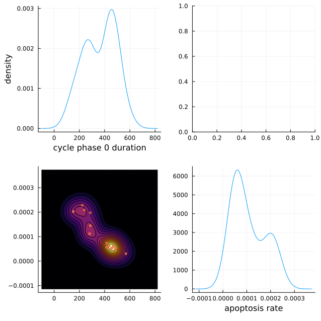
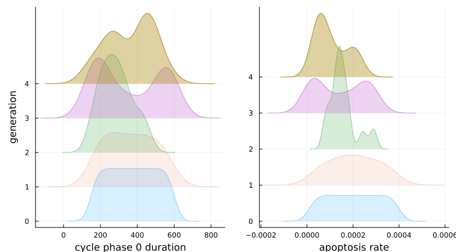
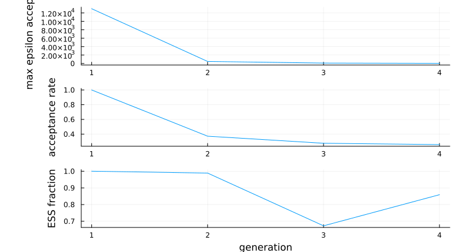
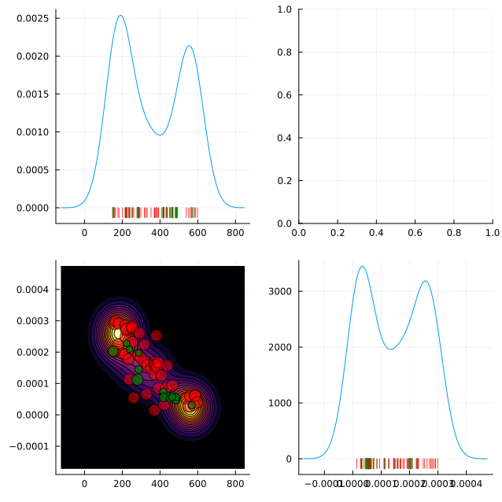

# [Calibration](@id calibration_section_man)

Fit a PhysiCell model's parameters to observed data with ABC-SMC, then inspect, sample, and re-run
the posterior.

!!! tierwhy
    **Why ABC-SMC.** Approximate Bayesian Computation — Sequential Monte Carlo is a likelihood-free
    inference method. It refines a population of parameter samples (particles) over successive
    generations, keeping only those whose simulated output falls within a shrinking tolerance
    (epsilon) of the observed data. An agent-based model has no tractable likelihood, so the method
    that applies is the one that only ever needs to *run* the model.

!!! tierdev
    The implementation is native Julia and needs no Python or conda environment. The algorithm is
    ModelManager's; PhysiCellModelManager.jl contributes the PhysiCell-specific summary statistics,
    and one `using PhysiCellModelManager` brings both.

!!! tierjournal "2026-04-22 — A Julia-native ABC-SMC, not a bridge to a Python one"
    **Decided:** implement ABC-SMC directly (Toni et al. 2009, Beaumont et al. 2009) on the existing
    monad/runner infrastructure, adding no dependencies, with the algorithm kept free of any
    PhysiCell wiring so it could move to ModelManager — which it since has.

    **Rejected:** the pyabc backend this replaced. It worked, but it managed a conda environment and
    was stuck on a single-core sampler, because Julia closures cannot be pickled. ApproxBayes.jl,
    KissABC.jl and SimulationBasedInference.jl were each rejected on their own grounds.

    **Open:** Gaussian-process emulation as a second calibration method.

## Quick start

!!! tiergloss
    Fix everything you are not calibrating in a reference monad, list the parameters you are with
    their priors, state the observed data, and hand the pieces to [`CalibrationProblem`](@ref).
    `run` takes a method and the problem, and returns the result that [`posterior`](@ref) reads.

```julia
using PhysiCellModelManager
using Distributions

# 1. Model inputs — fix non-calibrated parameters via a reference monad
inputs  = InputFolders("default", "default")
dv_time = DiscreteVariation(configPath("overall", "max_time"), 1440.0)
ref     = createTrial(inputs, [dv_time]; n_replicates = 0)

# 2. Parameters to infer, with priors from Distributions.jl
parameters = [
    DistributedVariation(
        configPath("cancer", "apoptosis", "rate"),
        Uniform(1e-4, 5e-3);
        name = "apoptosis_rate"
    ),
    DistributedVariation(
        configPath("cancer", "cycle", "duration", 0),
        Uniform(480.0, 1440.0);
        name = "cycle_duration"
    ),
]

# 3. Observed data — must match the return type of your summary statistic
observed_data = Dict("cancer" => 3500.0, "immune" => 800.0)

# 4. Build the problem
problem = CalibrationProblem(
    ref,                        # Monad — sets inputs + reference_variation_id
    parameters,
    observed_data,
    populationCountQoI(),       # summary statistic — see Built-in summary statistics
    mseDistance;                # distance function
    n_replicates = 3,
)

# 5. Run the calibration: a method object, then the problem
method = ABCSMC(
    population_size    = 200,
    max_nr_populations = 15,
    minimum_epsilon    = 0.05,
)
result = run(method, problem; description = "apoptosis-cycle calibration")

# 6. Extract the posterior
df, weights = posterior(result)                   # final generation
df3, w3     = posterior(result; generation = 3)   # specific earlier generation
```

## Defining the calibration problem

!!! tierwhy
    [`CalibrationProblem`](@ref) bundles everything the calibration loop needs: which model to run,
    which parameters vary and under what priors, what was observed, how one simulation is measured,
    and how that measurement is scored against the observation. Only the first of those has more
    than one spelling — inputs alone, a reference monad, or a [`StudySpec`](@ref) — and the choice
    is about what fixes the parameters you are *not* calibrating, as explained below.

### Simple form — `InputFolders` as first argument

!!! tiergloss
    Every non-calibrated parameter keeps its XML-file default.

```julia
problem = CalibrationProblem(
    inputs,              # InputFolders
    parameters,          # Vector of DistributedVariation / CoVariation / LatentVariation
    observed_data,       # whatever your distance's second argument expects (Dict, Vector, or scalar)
    summary_statistic,   # a QoI, a vector of QoIs, or a plain (sim::Simulation) -> value
    distance;            # (simulated, observed) → Float64
    n_replicates = 1,    # replicates per particle (combined by the QoI's `reduce`; mean by default)
)
```

### Reference monad form — fixing non-calibrated parameters

!!! tiergloss
    `n_replicates = 0` creates the monad entry without running any simulations; it only reserves
    the variation ID.

!!! tierwhy
    A `Monad` as the first argument supplies the `inputs` **and** locks every non-calibrated
    parameter to that monad's variation, exactly as it would with `run` or `createTrial`. The
    reference has to fix each such parameter to a single value, so build it from single-valued
    variations — a multi-valued one yields a `Sampling`, which this constructor does not accept.

```julia
# Fix max_time and save interval for every particle evaluation
dv_time     = DiscreteVariation(configPath("overall", "max_time"), 1440.0)
dv_interval = DiscreteVariation(configPath("full_data", "interval"), 60.0)
ref = createTrial(inputs, [dv_time, dv_interval]; n_replicates = 0)

problem = CalibrationProblem(
    ref,                 # Monad — provides both inputs and reference_variation_id
    parameters,
    observed_data,
    summary_statistic,
    distance;
    n_replicates = 3,
)
```

### [`StudySpec` form — one model-and-parameters half, two questions](@id studyspec_problem_form)

!!! tiergloss
    `CalibrationProblem(spec, observed_data, summary_statistic, distance; kwargs...)` takes the
    spec's inputs, parameters, reference variation and replicate count; `n_replicates` and
    `reference_variation_id` may still be overridden.

!!! tierwhy
    A [`StudySpec`](@ref) holds the half of a study that a sensitivity sweep and a calibration have
    in common: the input folders, the parameters, the baseline to vary from, and the replicate
    count. Build it once when you intend to ask both questions of the same model over the same
    parameters, and neither has to restate that half. `observed_data`, `summary_statistic` and
    `distance` stay on the problem, because a sensitivity study has none of them.

```julia
spec = StudySpec(inputs, parameters; n_replicates = 3)

gsa     = run(MOAT(), spec; functions = [populationCountQoI()])   # sensitivity, same spec
problem = CalibrationProblem(spec, observed_data, populationCountQoI(), mseDistance)
result  = run(ABCSMC(population_size = 200), problem)
```

### Parameters

!!! tiergloss
    All three forms take `name =` (the posterior's column name); `LatentVariation` also takes
    `target_names` and `inverse_maps`.

!!! tierwhy
    Any `DistributedVariation`, `CoVariation{DistributedVariation}`, or `LatentVariation` can be a
    calibration parameter, and priors come from `Distributions.jl`. A `CoVariation` draws all its
    members from one CDF value; a `LatentVariation` sends its latent parameters — one or several —
    through user-supplied maps to a set of XML paths, which is how a quantity with no XML path of
    its own gets calibrated.

    **`LatentVariation` needs `inverse_maps`.** For `DistributedVariation` and `CoVariation`
    parameters the inverse maps are constructed automatically; for a `LatentVariation` you supply
    one per latent dimension, satisfying `inverse_maps[i](maps[i](u)) ≈ u`. Leave them out and two
    things stop working: proposals are not snapped to existing monads, so nearly every proposal
    creates a new monad and the [simulation bank](@ref simulation_bank_calibration) has nothing to
    match against; and the run cannot be resumed.

```julia
# Single XML path with a continuous prior
dv = DistributedVariation(configPath("default", "migration", "speed"), LogNormal(0.0, 1.0))

# Two parameters that move together (CoVariation)
cv = CoVariation([
    DistributedVariation(configPath("cancer", "birth", "rate"),  Uniform(0.01, 0.1)),
    DistributedVariation(configPath("cancer", "death", "rate"),  Uniform(0.001, 0.05)),
])

# Latent variation: latent parameters drive several XML paths through user-supplied maps,
# with one inverse map per latent dimension.
lv = LatentVariation(
    [Uniform(0.0, 1.0)],
    [configPath("cancer", "apoptosis", "rate"), configPath("immune", "apoptosis", "rate")],
    [u -> 1e-4 * exp(5*u[1]), u -> 5e-5 * exp(5*u[1])];
    name = "apoptosis_scale",
    target_names = ["cancer_apoptosis", "immune_apoptosis"],
    inverse_maps = [v -> log(v[1] / 1e-4) / 5],
)
```

### Summary statistics

!!! tiergloss
    Pass a [`QoI`](@ref ModelManager.QoI), a vector of them, or a plain function of a `Simulation`.
    The ready-made ones are in [Built-in summary statistics](@ref builtin_ss).

!!! tierwhy
    A summary statistic measures **one simulation**; ModelManager combines a parameter set's
    replicates for you. A plain function is averaged across replicates with `mean`; pass a
    [`QoI`](@ref ModelManager.QoI) when you need a different reduction, or when the quantity must
    be computed *after* the replicates are combined rather than before.

```julia
function my_stat(sim::Simulation)
    # ... measure this one simulation ...
    return value
end

problem = CalibrationProblem(inputs, params, observed, my_stat, mseDistance)
```

### Distance functions

!!! tiergloss
    A distance is any `(simulated, observed) → Float64`.
    [`mseDistance`](@ref mse_distance_section) is the built-in one; a custom function may use any
    types.

!!! tierwhy
    `simulated` is a [`SummaryValues`](@ref): the object that carries each QoI's reduced value from
    `compute` through `reduce` into `distance`, so one problem can measure several quantities at
    once and score them together. It is keyed by `(qoi name, key)` and indexable three ways — by the
    key your own `reduce` returned (`sim["cancer"]`, while only one QoI reports that key), by the
    `"<qoi name>.<key>"` label the sink and sensitivity analysis also use
    (`sim["population_count.cancer"]`), or by the exact tuple (`sim[("population_count", "cancer")]`).
    A `Real`-valued QoI sits under its name alone. When the problem has a single-valued summary
    statistic there is nothing to choose between, and `only(values(simulated))` is that one value.
    `observed` is whatever you set `observed_data` to.

```julia
# Weighted MSE on two cell populations
function my_dist(sim, obs)
    return 0.9 * (sim["cancer"] - obs["cancer"])^2 +
           0.1 * (sim["immune"] - obs["immune"])^2
end

# A single-valued summary statistic: pull the one value out of the SummaryValues
function scalar_dist(sim, obs)
    return (only(values(sim)) - obs)^2
end

# L2 norm on one cell type's time series (the shape meanPopulationTimeSeriesQoI produces)
function ts_dist(sim, obs)
    return sum((sim["tumor"] .- obs["tumor"]).^2) / length(obs["tumor"])
end
```

## Running calibration

!!! tiergloss
    `run(method, problem)` returns the calibration result. Settings live on the [`ABCSMC`](@ref)
    object; `description`, `tags`, `run_kwargs`, `progress` and `on_monad_failure` are keywords of
    the call.

!!! tierwhy
    `run` dispatches on the method, so the verb is the same one that launches a trial or a
    sensitivity analysis, and the algorithm's settings all belong to the method object. Keeping an
    [`ABCSMC`](@ref) object in a variable is worth doing when you want to put the same settings to
    several problems.

    The keywords `run` itself takes are run controls, not settings: `description` is free-text prose
    stored in the database row, `tags` are the `key => value` labels you intend to search on (they
    are applied before any simulation is dispatched, so they survive an interrupted run),
    `run_kwargs` is forwarded to each underlying `run(sampling; ...)` call, `progress` picks the
    console verbosity (`:auto`, `:none`, `:generation`, `:batch`, `:bar`), and `on_monad_failure`
    is `:reject` (record the particle's distance as `missing`, so it is never accepted, and carry
    on) or `:error`.

    **Each generation proceeds the same way.** Generation 1 proposes `population_size` particles
    from a Sobol low-discrepancy sequence in the unit hypercube, one dimension per parameter, each
    coordinate mapped through its prior CDF — better prior coverage than random sampling.
    Generation *t > 1* systematically resamples a parent from the previous weighted generation and
    perturbs it with the fitted kernel. Every proposed particle becomes a `Monad` at those values,
    runs quietly, and is scored by your `summary_statistic` and `distance`. Particles below the
    current epsilon are accepted (generation 1 keeps everything), the population is reweighted with
    the standard ABC-SMC importance weights, the next epsilon is taken as the `epsilon_quantile`
    quantile of the accepted distances but never below `minimum_epsilon`, and the generation is
    written to disk before the stopping criteria are checked.

```julia
# Keep the method object to put the same settings to another problem
method = ABCSMC(population_size = 200, max_nr_populations = 15, minimum_epsilon = 0.05)
result = run(method, problem; description = "my run")

# Or construct it inline, with labels you can query later
result = run(
    ABCSMC(population_size = 200, store_rejected = true),
    problem;
    tags = ("project" => "immune-escape",),
    progress = :generation,
)
```

!!! tierdev
    **What `run` returns.** An [`ABCResult`](@ref) holds `calibration::Calibration` (the database
    row and its folder), `generations::Vector{GenerationResult}` in order, `parameters` — the
    [`CalibrationParameter`](@ref) objects that convert CDF coordinates back to target values — and
    `method::ABCSMC`. The run-level accessors take the result directly, so `.calibration` is
    optional: `Sampling`, `monadIDs`, `simulationIDs`, `tag!`, `tags`, [`calibrationsTable`](@ref)
    and [`deleteCalibration`](@ref) all forward to it.

    **Other spellings of the same call.** [`runABC`](@ref)`(problem; kwargs...)` and
    [`runCalibration`](@ref)`(method, problem)` are equivalent to `run(method, problem)`.

    **Adding a method.** [`AbstractCalibrationMethod`](@ref) is the supertype; [`ABCSMC`](@ref) is
    the only concrete subtype today. A new one is a new subtype plus the `run` method for it —
    which is the point of dispatching on the method rather than naming the algorithm in the verb.

!!! tierjournal "2026-09-15 — run(method, problem) is the calibration entry point"
    **Decided:** `run` dispatching on the method type is the documented entry point for a
    calibration, as it already is for a trial and for a sensitivity analysis. Adding a calibration
    method then adds a subtype and a `run` method, and no new verb anywhere.

    **Rejected:** keeping `runABC` as the documented name. It names one algorithm, so the manual
    would need a new verb for every method added, and a reader who learned `runABC` would have
    learned nothing transferable.

    **Open:** whether `runABC` and `runCalibration` should be formally deprecated. They are the
    signatures in every script written so far, and the wrappers cost nothing to keep; a deprecation
    warning is a cost paid by every existing user for a tidiness they did not ask for.

## [ABCSMC settings](@id abcsmc_settings)

!!! tiergloss
    All fields have defaults and are given as keyword arguments to [`ABCSMC`](@ref).

| Field | Default | Description |
|-------|---------|-------------|
| `population_size` | `100` | Accepted particles per generation |
| `max_nr_populations` | `10` | Maximum number of generations |
| `minimum_epsilon` | `0.01` | Stop when ε reaches this value |
| `epsilon_quantile` | `0.5` | Quantile of accepted distances used to set the next ε (default: median) |
| `perturbation_kernel` | `GaussianKernel()` | Proposal kernel; see [Perturbation kernels](@ref perturbation_kernels_calibration) |
| `epsilon_schedule` | `nothing` | Manual ε sequence overriding adaptive rule; see below |
| `min_acceptance_rate` | `0.0` (off) | Stop when acceptance rate drops below this fraction |
| `min_epsilon_decrease` | `0.0` (off) | Stop when relative ε decrease falls below this fraction |
| `min_ess_fraction` | `0.0` (off) | Stop when ESS / population_size falls below this fraction |
| `accept_overflow` | `false` | Keep all particles passing ε, not just `population_size` |
| `cdf_grid_k` | `nothing` (off) | Enable the [simulation bank](@ref simulation_bank_calibration) with dyadic-grid snapping at depth `k` |
| `max_evaluations` | `nothing` (off) | Hard budget cap on total particle evaluations |
| `store_rejected` | `false` | Persist rejected proposals, so `plot(result, :transition; space = :cdf)` can show them |

### Manual epsilon schedule

!!! tiergloss
    A strictly decreasing vector drives ε by hand instead of letting the algorithm adapt it.

!!! tierwhy
    Generation `t` uses `epsilon_schedule[t-1]`, and the schedule takes precedence over
    `epsilon_quantile`. A hand-written schedule can be far more aggressive than the data supports,
    so `min_acceptance_rate` is worth setting alongside it as a safety stop.

```julia
method = ABCSMC(
    population_size     = 100,
    epsilon_schedule    = [100.0, 30.0, 10.0, 3.0, 1.0],
    min_acceptance_rate = 0.01,   # stop if the schedule outruns what the data supports
)
```

### [Simulation bank and CDF-grid snapping (`cdf_grid_k`)](@id simulation_bank_calibration)

!!! tiergloss
    Setting `cdf_grid_k = k` lets a calibration reuse monads that already exist in the project —
    from earlier calibrations, prior sweeps, sensitivity designs — instead of simulating every
    proposal afresh.

!!! tierwhy
    With `cdf_grid_k = k`, ModelManager builds a registry — the *simulation bank* — of all existing
    monads whose calibrated parameters fall inside the prior support. For each proposal it first
    checks whether any bank entry falls within the grid cell around that proposal; if so, that
    monad is reused at its actual coordinates and nothing new is simulated. Only when no bank match
    is found is the proposal snapped to the nearest dyadic grid point at depth `k`, where a new
    simulation is run. The grid refines each generation (`k_eff = k + t − 1`), tracking the
    narrowing posterior.

```julia
method = ABCSMC(population_size = 200, max_nr_populations = 10, cdf_grid_k = 3)
```

!!! tierdev
    Only monads with at least one simulation running or completed are eligible; one whose
    simulations never started has nothing to reuse. The eligible monads are indexed in a KD-tree at
    calibration start and consulted at every proposal. A coordinate whose prior is discrete is never
    snapped to the grid — the dyadic grid does not divide evenly into its levels, so snapping would
    distort the prior over them — though bank reuse still applies to it.

### Evaluation budget (`max_evaluations`)

!!! tiergloss
    A hard cap on the total particle evaluations across the whole run, regardless of generation
    count.

!!! tierwhy
    The cap is applied before each batch of proposals is dispatched: a batch that would exceed the
    budget is trimmed to exactly the remaining allowance, so the run never evaluates more than
    `max_evaluations` particles. The final generation may therefore hold fewer than
    `population_size` particles, and if `max_evaluations` is below `population_size` even the first
    generation is trimmed. The current generation's accepted particles are saved before stopping.

    **The budget counts particles, not simulations.** Each particle evaluation is one `Monad`, and
    PCMM runs `n_replicates` simulations per monad (set on the [`CalibrationProblem`](@ref)). So
    `max_evaluations = 5000` with `n_replicates = 3` can launch up to 15,000 PhysiCell simulations
    — size the budget with your replicate count in mind.

```julia
method = ABCSMC(population_size = 100, max_nr_populations = 20, max_evaluations = 5000)
```

!!! tierjournal "2026-07-08 — The evaluation budget counts particles, not simulations"
    **Decided:** `max_evaluations` is checked before each batch is dispatched and counts particle
    evaluations, so a run launches up to `max_evaluations × n_replicates` simulations and its last
    generation may be partial. Checked against the batch-capping code rather than assumed.

## [Perturbation kernels](@id perturbation_kernels_calibration)

!!! tiergloss
    The kernel controls how generation-t+1 proposals are drawn from generation-t particles. Pass it
    as `perturbation_kernel` to [`ABCSMC`](@ref).

!!! tierwhy
    The default `scale` is `2.0`, following Beaumont et al. (2009): a proposal kernel is
    deliberately over-dispersed relative to the posterior it was fitted to, because a kernel that
    matched the posterior exactly would never propose anything outside it and the population would
    collapse. A per-generation vector lets you tighten it as the posterior narrows: generation `t`
    uses `scale[min(t, end)]`, so a vector shorter than the run is not an error — its last entry
    holds for every generation after it.

| Kernel | When to use |
|--------|-------------|
| [`GaussianKernel`](@ref) (default) | Low-dimensional problems with roughly elliptical posteriors |
| [`ComponentwiseKernel`](@ref) | High dimensions where full covariance estimation is noisy |
| [`LocalNNKernel`](@ref) | Posteriors that concentrate at different rates in different regions |
| [`LocalNNCovKernel`](@ref) | Strongly anisotropic or banana-shaped posteriors |

```julia
# Full covariance Gaussian (default)
method = ABCSMC(perturbation_kernel = GaussianKernel())

# Diagonal — independent per-parameter bandwidths
method = ABCSMC(perturbation_kernel = ComponentwiseKernel())

# Local bandwidth based on k nearest neighbors
method = ABCSMC(perturbation_kernel = LocalNNKernel(k = 15))

# Local covariance based on k nearest neighbors
method = ABCSMC(perturbation_kernel = LocalNNCovKernel(k = 15))

# GaussianKernel and ComponentwiseKernel take an optional `scale` on the weighted (co)variance
GaussianKernel(1.0)          # scale = 1 × covariance, in every generation
GaussianKernel([1.0, 2.0])   # generation t uses scale[min(t, end)]: 1.0, then 2.0 from gen 2 on
```

## Resuming a calibration

!!! tiergloss
    `run(calibration)` continues a [`Calibration`](@ref) from the next generation. The original
    [`CalibrationProblem`](@ref) is read from `problem.jld2` in the calibration folder and the
    settings from `method.toml`, so a calibration ID is normally all you need.

!!! tierwhy
    An interrupted run — crash, user stop, HPC timeout — has already saved its completed
    generations to disk, so resuming appends rather than repeats.

    **`method =` replaces; keywords patch.** An `ABCSMC` object supplies *every* field, so
    `method = ABCSMC(max_nr_populations=20)` silently resets population size, kernel, epsilon rule
    and the rest to constructor defaults rather than the values the run used. To change some
    settings and keep the rest, pass them as keywords. Passing both a `method` object and
    individual settings is an error. Whenever the effective settings differ from `method.toml` the
    file is rewritten to match, so a later resume does not revert. Nothing already on disk is
    recomputed, so a changed setting takes effect from the next generation onward.

```julia
# Load the calibration by ID and continue from where it left off
calibration = Calibration(42)
result = run(calibration)

# Patch one setting — e.g. allow more generations than the original run
result = run(calibration; max_nr_populations = 20)

# If the original problem used anonymous functions (not serializable), re-supply it
result = run(calibration; problem = problem)

# resumeCalibration is the same call, and resumeABC is its ABC-specific alias
result = resumeCalibration(calibration; max_nr_populations = 20)
result = resumeABC(calibration)
```

### Resumability and anonymous functions

!!! tiergloss
    A function the calibration cannot restore by name has to be handed back on resume, as
    `run(calibration; problem = problem)`.

!!! tierwhy
    ModelManager saves the `CalibrationProblem` to `problem.jld2` at the start of each run, and can
    restore a function from it only when JLD2 can name it: a function defined at the top level of a
    file or module. A lambda or closure — including a named function defined *inside* another
    function — is saved as `nothing`, and a bare `run(Calibration(42))` then refuses with
    "problem.jld2 contains only a partial manifest" until you re-supply the problem.

    PCMM's QoI builders restore on their own: their keyword arguments travel in the QoI's `data`
    slot and both of their functions are named. Do the same for a measurement of your own that
    needs parameters — pass them as `data=` instead of capturing them in a closure; that switches
    `compute` and `reduce` to `(sim, data)` and `(values, data)`, and the
    [ModelManager calibration manual](https://drbergman-lab.github.io/ModelManager.jl/stable/man/calibration/)
    works through an example. [`mseDistance`](@ref mse_distance_section) and any other top-level
    function restore as well.

```julia
# Custom logic: define at module level (not inside another function or as a lambda).
# A summary statistic measures ONE simulation; the library reduces the replicates.
function my_stat(sim::Simulation)
    counts = finalPopulationCount(sim)
    # ... transform as needed ...
    return counts
end

apoptosis_map(u) = 1e-4 * exp(5*u[1])
apoptosis_inv(v) = log(v[1] / 1e-4) / 5

lv = LatentVariation(
    [Uniform(0.0, 1.0)],
    [configPath("cancer", "apoptosis", "rate")],
    [apoptosis_map];
    inverse_maps = [apoptosis_inv],
)

# Anonymous: problem.jld2 will be incomplete, so keep `problem` to re-supply on resume
problem = CalibrationProblem(ref, params, observed,
    sim -> finalPopulationCount(sim)["cancer"] / 1000,   # a lambda cannot be restored by name
    mseDistance)
result = run(Calibration(42); problem = problem)
```

## Inspecting results

### Posterior samples

!!! tiergloss
    [`posterior`](@ref) returns the tuple `(df, weights)`: a `DataFrame` with one column per
    calibrated parameter (display names) and one row per particle, and a `Vector{Float64}` of
    importance weights summing to 1. It reads a live result or a [`Calibration`](@ref) on disk. To
    draw *new* parameter sets from that posterior rather than read the particles it holds, see
    [Sampling the posterior](@ref posterior_sampling_calibration).

```julia
# From a live result
df, weights = posterior(result)                   # final generation
df3, w3     = posterior(result; generation = 3)   # any earlier generation

# From just a calibration ID (after a session restart)
df, weights = posterior(Calibration(42))
df, weights = posterior(Calibration(42); generation = 3)
```

!!! tierdev
    A [`GenerationResult`](@ref) is what a generation actually stored, and `posterior` is the view
    of it in target space. Its `particles` frame holds **latent CDF coordinates**, the algorithm's
    internal representation; alongside it are `weights`, `distances`, `monad_ids`, `ess`,
    `acceptance_rate`, `n_evaluations`, `max_epsilon_accepted` and `epsilon_threshold`.
    `proposal_distances` records every proposal accepted or not; `rejected_proposals` is populated
    only under `ABCSMC(store_rejected = true)`.

### Convergence diagnostics

!!! tiergloss
    [`ConvergenceSummary`](@ref) collects the per-generation statistics into one table, from a
    result or from a calibration ID. It behaves like a `DataFrame` for property access
    (`cs.max_epsilon_accepted`).

!!! tierwhy
    It is the run's own history in one place, and it is how you tell a run that converged from one
    that merely stopped: how far epsilon actually fell, how hard each generation had to work to fill
    itself, and how much of the population its weights genuinely represent. Its docstring names
    every column.

```julia
cs = ConvergenceSummary(result)
# or, from a calibration ID after a session restart:
cs = ConvergenceSummary(Calibration(42))
```

### Visualization

!!! tiergloss
    Requires a Plots.jl backend (`using Plots`). Every recipe accepts a [`Calibration`](@ref) in
    place of the result, loading the data from disk. The figures below come from a two-parameter
    example: a cycle phase duration and an apoptosis rate, calibrated to one simulation's final cell
    count on the template project.

```julia
plot(result)                       # corner (pairs) plot of the final-generation posterior
plot(result; generation = 3)       # a specific generation
plot(result; space = :cdf)         # CDF coordinates (should be ≈ Uniform for a good fit)
plot(Calibration(42))              # from disk, with no in-memory result
```



```julia
plot(result, :ridgeline)           # posterior narrowing across generations, one panel per parameter
plot(Calibration(42), :ridgeline)  # the same, from disk
```



```julia
plot(ConvergenceSummary(result))   # epsilon, acceptance rate and ESS fraction per generation
```



```julia
# gen-t posterior plus the gen-(t+1) proposals drawn from it (accepted green, rejected red)
plot(result, :transition)                  # last complete transition
plot(result, :transition; generation = 2)  # a specific transition t → t+1
```



## [Sampling the posterior](@id posterior_sampling_calibration)

!!! tiergloss
    `samplePosterior(result_or_calibration, n; generation = :final, smooth = false, rng)` returns
    the draws; `createTrial(result, draws)` turns them into a runnable `Sampling`, one monad per
    distinct parameter set, ready for `run`.

!!! tierwhy
    A posterior is worth more than its summary statistics: drawing parameter sets from it and
    running them is a posterior predictive check. [`samplePosterior`](@ref) draws `n` parameter
    sets as a `DataFrame` of display columns. By default each draw is one of the accepted
    particles, resampled with probability equal to its importance weight, so the frame carries a
    `monad_id` column and the check can read those monads' existing output instead of simulating
    again. With `smooth = true` the weighted particles become a Gaussian kernel density estimate
    and the draws are new parameter sets between them, so there is no `monad_id`.

    The kernel is fitted in CDF space, which is what keeps a draw inside every prior's support,
    respects a log-scaled prior, and lands a discrete parameter on one of its levels. Its bandwidth
    is *not* the run's `perturbation_kernel` scale, which is deliberately over-dispersed for
    proposals.

```julia
draws      = samplePosterior(result, 200)                    # existing particles, with monad_id
new_points = samplePosterior(result, 200; smooth = true)     # new parameter sets, no monad_id
samplePosterior(Calibration(42), 50; generation = 2)         # from disk

# Run the draws: one monad per distinct parameter set, over the calibration's own inputs
sampling = createTrial(result, new_points)
run(sampling)

# `n_replicates` defaults to the run's; a Calibration works in place of the result
sampling = createTrial(Calibration(42), draws; n_replicates = 5)
```

!!! tierdev
    `createTrial(result, draws)` turns each row's target values into one `DiscreteVariation` per
    calibrated target, resolved against the run's reference variation exactly as the calibration
    created its own monads. A plain draw therefore resolves to the monad it came from and adds no
    simulations unless `n_replicates` exceeds the run's; a smoothed draw creates a new monad. The
    inputs, reference variation and default `n_replicates` are read from `problem.jld2`, but only
    each parameter's targets and types are needed, not its maps, so this works even for a
    `LatentVariation` saved with anonymous maps. Smoothed sampling from a `Calibration` does need
    those maps, and its error names `resumeABC(cal; problem = my_problem)` as the way back.

## Managing calibration runs

!!! tiergloss
    [`calibrationsTable`](@ref) is one row per run — `CalibrationID`, `DateTime`, `Method`,
    `Description` — and [`printCalibrationsTable`](@ref) prints it, or sends it to any `sink`.
    [`deleteCalibration`](@ref) removes a run's database row, its tags, and its output folder.

!!! tierwhy
    `delete_subs` defaults to `false`, unlike the trial-level deleters, because a calibration's
    monads are shared — through the simulation bank and `use_previous` they may predate the run and
    outlive it. Passing `true` deletes only the monads these runs alone used. Deleting a run
    discards the folder that holds the generation CSVs, the serialized problem and the settings, so
    [`posterior`](@ref) and [`resumeCalibration`](@ref) stop working for it.

```julia
calibrationsTable()                       # every run in the project
calibrationsTable(; tags = true)          # plus one column per tag key in use
calibrationsTable([1, 2, 3])              # specific IDs; a Calibration or a run's result also works

printCalibrationsTable()
using CSV
printCalibrationsTable(; sink = df -> CSV.write("calibrations.csv", df))

deleteCalibration(result)                 # bookkeeping and folder only
deleteCalibration(3; delete_subs = true)  # and the monads no other run uses
```

## Output layout

!!! tiergloss
    Each run creates `data/outputs/calibrations/{id}/`: three files describing the run, then one
    folder per generation, named by generation number zero-padded to fit `max_nr_populations`.

```
data/outputs/calibrations/1/
├── problem.jld2          # the serialized CalibrationProblem, so a resume needs no re-supplied problem
├── method.toml           # the ABCSMC settings
├── parameters.toml       # display name → database column → prior, per parameter
└── generations/
    ├── 01/
    │   ├── particles.csv          # accepted particles, in target space
    │   ├── cdfs.csv               # the same particles in CDF space
    │   ├── metadata.toml          # both epsilons, ESS, acceptance rate, evaluation count
    │   ├── monads.csv             # every monad evaluated, as compressed ID ranges
    │   ├── proposals.csv          # distance and outcome for every proposal
    │   ├── failed_simulations.csv # only when a simulation failed
    │   └── failed_monads.csv      # only when a monad lost every simulation
    ├── 02/
    └── …
```

!!! tierdev
    ModelManager owns this layout and documents every column under
    [What a run leaves on disk](https://drbergman-lab.github.io/ModelManager.jl/stable/man/calibration/#What-a-run-leaves-on-disk).

## [Built-in summary statistics](@id builtin_ss)

!!! tiergloss
    Three builders, each returning a [`QoI`](@ref ModelManager.QoI) that measures a single
    [`Simulation`](@ref) — the shape [`CalibrationProblem`](@ref) asks for — whose value is a
    `Dict` keyed by cell type. Pass the builder's result where the summary statistic goes.

!!! tierwhy
    A builder measures a simulation inside a study. To analyze a finished monad directly instead,
    use [`finalPopulationCount`](@ref) on a `Monad` or `MonadPopulationTimeSeries`: they take a
    monad and do their own averaging.

```julia
problem = CalibrationProblem(inputs, params, observed, populationCountQoI(), mseDistance)

populationCountQoI(; cell_types=["cancer", "immune"])   # or restrict the measurement
```

### [`populationCountQoI`](@id population_count_qoi_section)

!!! tiergloss
    Each cell type's population count at the snapshot `index` names — `:final` by default.
    `compute` returns `missing` when that snapshot is not on disk.

```julia
populationCountQoI(; index=:final, cell_types=nothing, include_dead=false)
```

### [`populationFractionQoI`](@id population_fraction_qoi_section)

!!! tiergloss
    Each cell type's **fraction** of the total population at that same snapshot. The denominator is
    the whole population, so restricting to one cell type reports its share of everything rather
    than 1.0.

```julia
populationFractionQoI(; index=:final, cell_types=nothing, include_dead=false)
```

### [`meanPopulationTimeSeriesQoI`](@id mean_population_time_series_qoi_section)

!!! tiergloss
    Each cell type's count over time, on the replicate's own grid, averaged elementwise across
    replicates. Use it when `observed_data` is a time series rather than a single endpoint value.

```julia
meanPopulationTimeSeriesQoI(; cell_types=nothing, include_dead=false)
```

### [Using the builders in sensitivity analysis](@id qoi_form_ss)

!!! tiergloss
    The same builders are a `functions=` entry for a
    [Sensitivity analysis](@ref sensitivity_analysis_man). Omit `cell_types` and every cell type
    present in the output is measured, since a QoI discovers them from the simulation rather than
    naming them at construction.

!!! tierwhy
    [`populationCountQoI`](@ref) and [`populationFractionQoI`](@ref) spread a `Dict`-valued
    measurement into one sensitivity analysis per key — the same reading the post-processing sink
    gives it — so `populationCountQoI()` yields one analysis per cell type without naming them in
    advance, labeled `population_count.<cell_type>`. [`meanPopulationTimeSeriesQoI`](@ref) does
    **not**: each of its components is a time series rather than the `Real` an index is computed
    from. See [Running the analysis](@ref gsa_keyed_qoi).

    No builder defines a `reduce`, so replicates are averaged by ModelManager's default per-key
    mean.

```julia
run(MOAT(), inputs, evs; functions = [populationCountQoI()])   # one analysis per cell type
```

!!! tierjournal "2026-09-14 — One builder per quantity, one reducer for all of them"
    **Decided:** each quantity gets exactly one builder — `populationCountQoI(; index)` and
    `populationFractionQoI(; index)` read the snapshot at `index`, `:final` by default — and none of
    them defines a `reduce`, so all are averaged by ModelManager's default per-key mean. Sink
    columns and labels are `population_count.<cell_type>` and `population_fraction.<cell_type>`.

    **Rejected:** a separate endpoint builder beside each. Once the two reduced identically it was
    the same measurement under a second name and a second family of sink columns.

## Built-in distance functions

### [`mseDistance`](@id mse_distance_section)

!!! tiergloss
    Pass it as the `distance` argument of a [`CalibrationProblem`](@ref). Outside calibration it
    also compares two keyed values, two scalars, or any pair that broadcasts, including two arrays;
    its docstring lists all five forms.

!!! tierwhy
    The keys of `observed_data` are the comparison. [`mseDistance`](@ref) resolves each one in the
    simulated [`SummaryValues`](@ref) — an observed key the summary statistic did not produce is an
    error rather than a silent zero, and an extra simulated component is ignored, since a simulation
    is always known better than the data. Every squared difference is then summed — a time-series
    value contributing one difference per time point — and the total is divided by the number of
    differences computed.

```julia
problem = CalibrationProblem(ref, parameters, observed_data, populationCountQoI(), mseDistance)

mseDistance(3400.0, 3500.0)                    # two scalars
mseDistance([1.0, 2.0, 3.0], [1.0, 2.5, 2.0])  # two arrays
```
