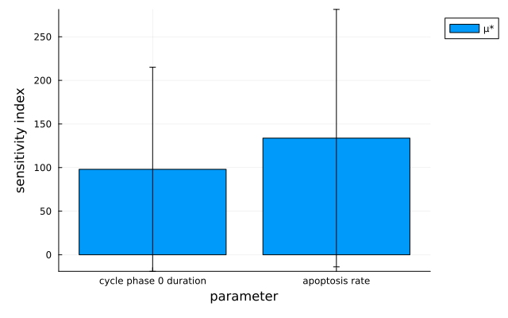
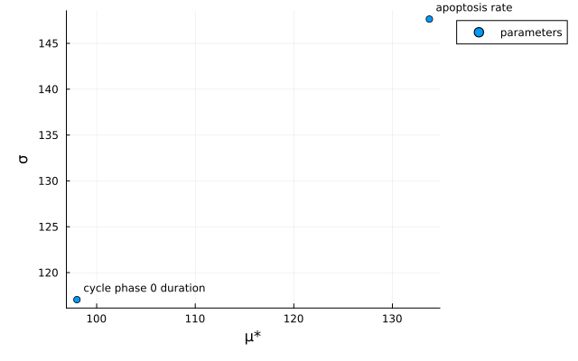
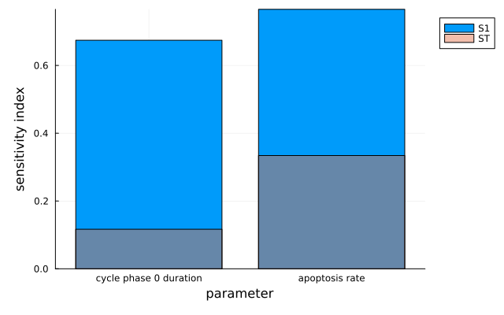
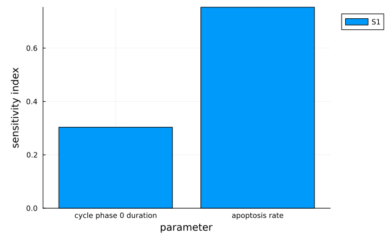

# [Sensitivity analysis](@id sensitivity_analysis_man)

Find out which parameters your model's output actually depends on, reusing simulations you have
already run.

## Supported sensitivity analysis methods

!!! tiergloss
    Three methods are available. Each is a constructor you pass to `run` along with the model and
    the parameters to vary.

| Method | Gives | Notes |
|--------|-------|-------|
| `MOAT` | One screening sensitivity (µ*, σ) per parameter | Cheapest; intuitive rather than rigorous |
| `Sobolʼ` | First-order and total-order variance indices | Most rigorous, most simulations |
| `RBD` | First-order indices only | Far cheaper than Sobol', one monad per design point |

### Morris One-At-A-Time (MOAT)

!!! tierwhy
    MOAT trades theoretical rigor for an intuitive sensitivity estimate. It samples parameter space
    at `n` points; from each, it varies one parameter at a time and records the change in output,
    then aggregates those changes into a sensitivity for each parameter.

    Sampling is by Latin Hypercube Sampling (LHS), using each bin's centerpoint as the base point.
    `add_noise=true` picks a random point within the bin instead. [`MOAT`](@ref) furthermore uses an
    orthogonal LHS where it can: if `n=k^d` for some integer `k` — `n` the requested number of base
    points, `d` the number of parameters varied — the LHS will be orthogonal. For example `n=16`
    and `d=4` give `k=2`. Set `orthogonalize=false` to prevent that.

```julia
MOAT()                       # will default to n=15
MOAT(8)                      # set n=8
MOAT(8; add_noise=true)      # use a random point in the bin, not necessarily the center
MOAT(8; orthogonalize=false) # do not use an orthogonal LHS (even where one is possible)
```

### Sobol'

!!! tierwhy
    The Sobol' method quantifies sensitivity from the variance of the model output. It uses a
    Sobol' sequence — a deterministic _low-discrepancy_ sequence that fills the unit hypercube very
    evenly, approximating quantities like integrals with far fewer points than random sampling. The
    sequence is built around powers of 2, so `n=2^k` (or ±1) gives the best results. See
    [`SobolVariation`](@ref) for how PhysiCellModelManager.jl uses the sequence and how to control
    it.

    If the extremes of your distributions (where the CDF is 0 or 1) are non-physical — an unbounded
    normal distribution, say — consider `n=2^k-1` to pick a subsequence that excludes them: `n=7`
    gives `[0.5, 0.25, 0.75, 0.125, 0.375, 0.625, 0.875]`. To include the extremes, use `n=2^k+1`:
    `n=9` gives `[0, 0.5, 0.25, 0.75, 0.125, 0.375, 0.625, 0.875, 1]`.

!!! tiergloss
    First-order index methods: `:Sobol1993`, `:Jansen1999`, `:Saltelli2010` (default
    `:Jansen1999`). Total-order: `:Homma1996`, `:Jansen1999`, `:Sobol2007` (default `:Jansen1999`).
    The rasp symbol `ʼ` avoids a clash with the `Sobol` module — type `\rasp` then tab in VS Code —
    and [`SobolMM`](@ref) is the plain-ASCII alias.

```julia
Sobolʼ(9)
Sobolʼ(9; skip_start=true) # skip to the odd multiples of 1/32 (smallest one with at least 9)
SobolMM(9)                 # same constructor, no rasp required
```

!!! tierdev
    `SobolPCMM` is a deprecated alias of [`SobolMM`](@ref), kept because PCMM exported it before
    the name was generalized. New code should use [`SobolMM`](@ref) or [`Sobolʼ`](@ref).

### Random Balance Design (RBD)

!!! tierwhy
    RBD uses a random design matrix (like Sobol') and a Fourier transform (as in the FAST method).
    For `n` design points it runs `n` monads, then rearranges the outputs so each parameter in turn
    varies along a sinusoid, and estimates first-order indices via Fourier transforms. It looks up
    to the 6th harmonic by default (`num_harmonics`).

    By default the Sobol' sequence picks the design points, and `n` **must** then be within 1 of a
    power of 2 — 7, 8 or 9, say. This is a requirement, not a preference: a value further away
    raises an error at construction rather than falling back. A half-period of a sinusoid is used
    when converting the design points into CDF space. `use_sobol=false` lifts the restriction: `n`
    is then unconstrained, random permutations of `n` uniformly spaced points are used in each
    parameter dimension, and a full period of a sinusoid is used for the CDF conversion.

    Choosing `n=2^k - 1` or `n=2^k + 1` leaves you well-positioned to increment `k` and rerun for
    more accurate results, because PhysiCellModelManager.jl starts from the beginning of the Sobol'
    sequence to cover those `n` points and no run is repeated. With `n=2^k` it instead picks the
    `n` odd multiples of `1/2^(k+1)`, which are not reused when `k` is incremented.

```julia
RBD(9)                    # will use a Sobol' sequence with elements chosen from 0:0.125:1
RBD(32; use_sobol=false)  # opt out of using the Sobol' sequence
RBD(22; use_sobol=false)  # `n` need not sit near a power of 2 once you opt out of Sobol'
RBD(32; num_harmonics=4)  # will look up to the 4th harmonic, instead of the default 6th
```

## Setting up a sensitivity analysis

### Simulation inputs

!!! tierwhy
    A sensitivity analysis takes the same inputs as a sampling: an `inputs::InputFolders` naming the
    `data/inputs/` folders that define your model, and an `evs::Vector{<:ElementaryVariation}` of
    the parameters to analyze with their ranges or distributions. Unlike most trials these are
    usually [`DistributedVariation`](@ref)s, so a continuum of values can be tested.

    [`CoVariation`](@ref)s draw all member parameters from the same CDF value; pass `flip` to
    negatively correlate some of them. For more complex relationships, use
    [LatentVariations](@ref latent_variations_man) to transform latent variables into the
    parameters of interest.

!!! tiergloss
    Use the convenience constructors [`UniformDistributedVariation`](@ref) and
    [`NormalDistributedVariation`](@ref), or any `d::Distribution` directly. All variation types
    accept `name=...`, used in the scheme DataFrame/CSV headers; inspect the effective name with
    [`variationName`](@ref).

```julia
dv = DistributedVariation(xml_path, d)                          # any d::Distribution

UniformDistributedVariation(xml_path, 720, 2880)                # (lower, upper)
NormalDistributedVariation(xml_path, 1e-3, 1e-4; lb=0)          # (mean, std), truncated at lb
```

### Sensitivity functions

!!! tierwhy
    A sensitivity function takes a single argument, a `Simulation`. Declare it `::Simulation`:
    an unannotated function cannot be told apart from one written to take a simulation ID (`Int`).
    A bare function's per-replicate values must average to a `Real`; passed as a
    [`QoI`](@ref ModelManager.QoI), `reduce` may instead return a `Dict`/`NamedTuple` of `Real`s,
    which spreads — see below.

!!! tiergloss
    Any number of them may be given at the start of the analysis. `finalPopulationCount` returns a
    dictionary of each cell type's final count from a `Simulation`, so one cell type's count is one
    lookup away.

```julia
f(sim::Simulation) = finalPopulationCount(sim)["cancer"]
```

### [One measurement, one analysis per cell type](@id gsa_keyed_qoi)

!!! tierwhy
    Naming a cell type up front means one function per cell type. Pass a
    [`QoI`](@ref ModelManager.QoI) whose `reduce` returns a `Dict` instead, and each key becomes its
    own sensitivity analysis labelled `"<qoi name>.<key>"`. The ready-made builders do this
    already, and [`populationFractionQoI`](@ref) works the same way as
    [`populationCountQoI`](@ref).

!!! tierwhy
    **Two shapes that are not spread.** Two separate rules. A bare `Vector` return is **not** spread
    by index — components are keyed, for now, so that two parameter sets can be checked for the same
    components by name. Separately, every spread component must itself be a `Real`. It is the second
    that rules out [`meanPopulationTimeSeriesQoI`](@ref): its `Dict` *is* spread, and each value is
    then rejected for being a time series rather than a number. Reduce a series to a scalar to ask a
    sensitivity question about it. No builder defines a `reduce` of its own, so ModelManager's
    default per-key mean averages the replicates of all of them.

    **Every parameter set in the design must reduce to the *same* keys.** A mismatch is refused
    rather than filled in, because a sensitivity index computed over a missing value is wrong rather
    than approximate. PCMM's builders satisfy this by construction: the key set is the model's own
    cell-type roster, taken from the snapshot's metadata rather than from which types happen to have
    living cells, so a type driven extinct by some parameter set still reports a count of zero
    instead of dropping its key.

!!! tiergloss
    The code below yields `population_count.cancer`, `population_count.immune`, and one more for
    every other cell type — without naming any of them in advance, since they are read from the
    simulation's own output.

```julia
run(method, inputs, evs; n_replicates=n_replicates, functions=[populationCountQoI()])
```

## Running the analysis

!!! tiergloss
    `run(method, inputs, evs; functions=...)` launches the design and returns the sampling object
    the post-processing step works on. A `reference::AbstractMonad` or a `StudySpec` may stand in
    for `inputs`.

```julia
config_folder = "default"
custom_codes = "default"
inputs = InputFolders(config_folder, custom_codes)
n_replicates = 3
evs = [NormalDistributedVariation(configPath("cancer", "apoptosis", "rate"), 1e-3, 1e-4; lb=0),
       UniformDistributedVariation(configPath("cancer", "cycle", "duration", 0), 720, 2880)]
method = MOAT(15)
f(sim::Simulation) = finalPopulationCount(sim)["cancer"]
sensitivity_sampling = run(method, inputs, evs; n_replicates=n_replicates, functions=[f])

# Named parameters, so the scheme CSV and the plots read as something other than XML paths
evs = [NormalDistributedVariation(configPath("cancer", "apoptosis", "rate"), 1e-3, 1e-4; lb=0, name="Apoptosis rate"),
       UniformDistributedVariation(configPath("cancer", "cycle", "duration", 0), 720, 2880; name="Cycle duration")]
```

!!! tierdev
    **What `run` returns.** A subtype of
    [`GSASampling`](@ref PhysiCellModelManager.ModelManager.GSASampling), the abstract type for
    global sensitivity analysis results: `MOATSampling`, `SobolSampling`, or `RBDSampling`, one per
    method. The methods themselves share the abstract supertype `GSAMethod`, whose subtypes are
    [`MOAT`](@ref), [`Sobolʼ`](@ref) and [`RBD`](@ref). The concrete sampling type is the pairing —
    it is what `calculateGSA!` dispatches on to decide how the indices are computed, and what the
    plot recipes dispatch on to decide how they are drawn. It also decides how the scheme is saved.
    A new method is therefore a `GSAMethod` subtype, a matching `GSASampling` subtype, and the
    `calculateGSA!` method that joins them.

## Post-processing

!!! tierwhy
    Results accumulate, and a measurement whose name is already present is **skipped** — so reusing
    the name `f` from the run above would do nothing at all, silently. Pass `recompute=true` to
    force re-evaluation; it has to be explicit, because redefining a function's body leaves it
    indistinguishable from the one already evaluated. Results are stored in a `Dict` keyed by the
    label of the measurement that produced them — a measurement's own name, or `"<name>.<key>"` for
    each key of a `Dict`-valued one.

    The method also determines how the sensitivity scheme is saved. After running the simulations,
    PhysiCellModelManager.jl writes a CSV in `data/outputs/samplings/$(sampling.id)` named after the
    method — `moat_scheme.csv`, `sobol_scheme.csv`, or `rbd_scheme.csv`. Parameter columns in this
    CSV use the latent parameter names for the sampling design, which include user-specified
    variation names when provided. The simplest way to reload the sampling in a new Julia session is
    to re-run the code that generated it: so long as `use_previous` is `true`, the previous results
    are reused.

!!! tiergloss
    [`PhysiCellModelManager.calculateGSA!`](@ref) computes sensitivity indices for further
    measurements on a sampling you already ran, and files them in `sensitivity_sampling.results`.

```julia
g(sim::Simulation) = finalPopulationCount(sim)["default"] # a *new* measurement, under a new name
calculateGSA!(sensitivity_sampling, g)

println(sensitivity_sampling.results["f"])
```

!!! tierdev
    [`gsaLabels`](@ref ModelManager.gsaLabels)`(sensitivity_sampling)` lists the labels present,
    sorted — one label is not one `functions=` entry, since a `Dict`-valued measurement contributes
    one per key. It is public in ModelManager but not exported, so it needs the prefix:
    `ModelManager.gsaLabels(sensitivity_sampling)`, e.g. `["population_count.cancer", "f"]`. Each
    label indexes `sensitivity_sampling.results`.

## Plotting

!!! tiergloss
    Requires a Plots.jl backend (`using Plots`). Every sampling has a plot recipe; a positional
    symbol picks the style where there is more than one, and `parameters=` restricts the x-axis to
    some parameters, drawn in the order given — anything `select` accepts on a `DataFrame` works.

```julia
plot(moat_sampling)                       # µ* per parameter (the default, :bar)
plot(moat_sampling; show_sigma=true)      # σ as whiskers on the µ* bars
plot(moat_sampling, :scatter)             # the µ*–σ screening scatter
plot(moat_sampling, :violin)              # elementary-effect distributions; needs StatsPlots
plot(sobol_sampling)                      # first-order S1 bars with total-order ST behind them
plot(sobol_sampling; show_ST=false)       # S1 only
plot(rbd_sampling)                        # first-order bars
plot(moat_sampling; parameters=["Apoptosis rate"])   # a subset, in this order
```

!!! tiergloss
    The figures below come from the template project, varying a cycle phase duration and the
    apoptosis rate with the final cell count as the measurement. The Sobol' bars are illustrative
    values rather than a measured design.








